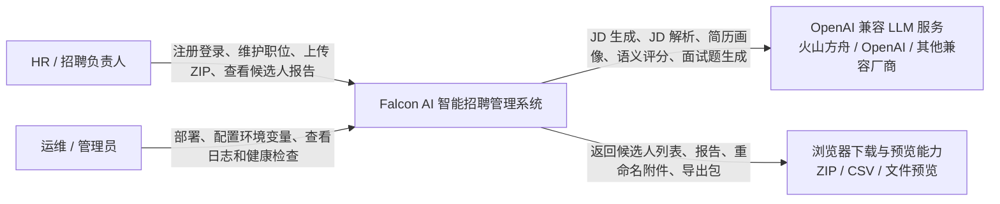
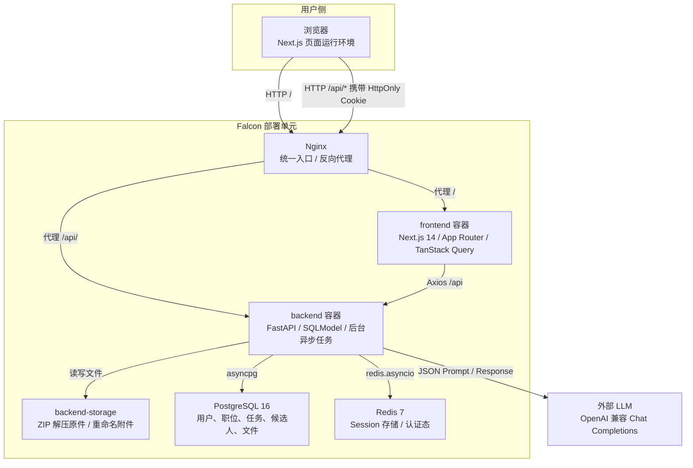
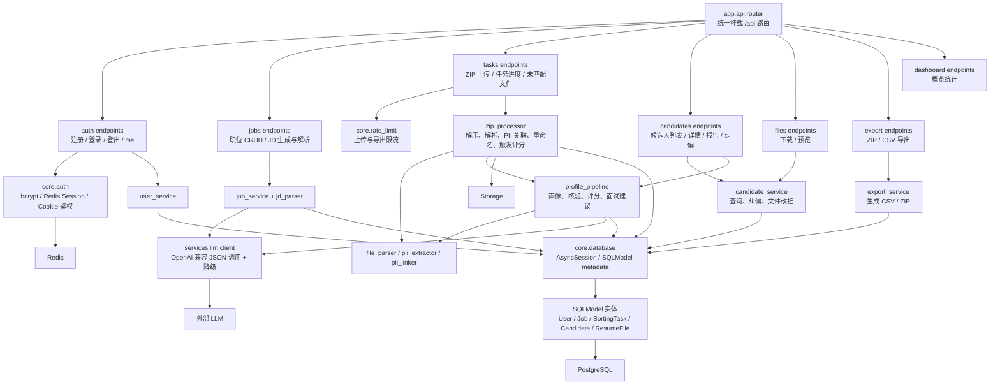
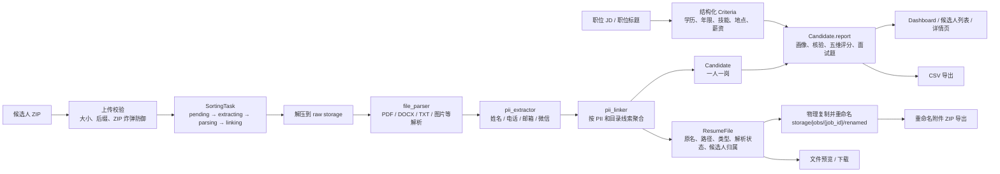
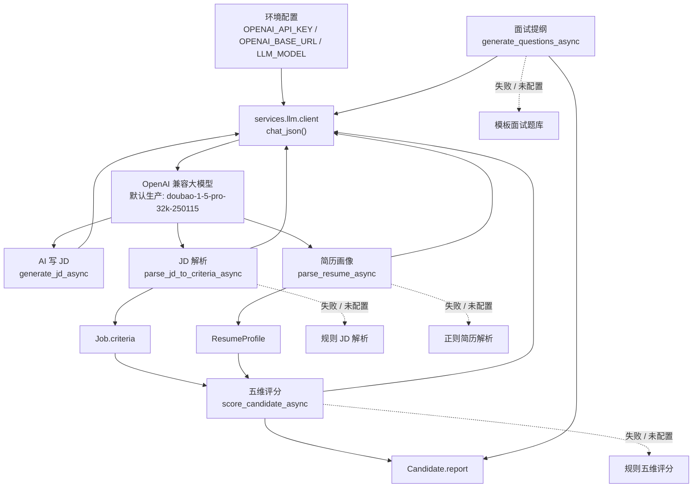
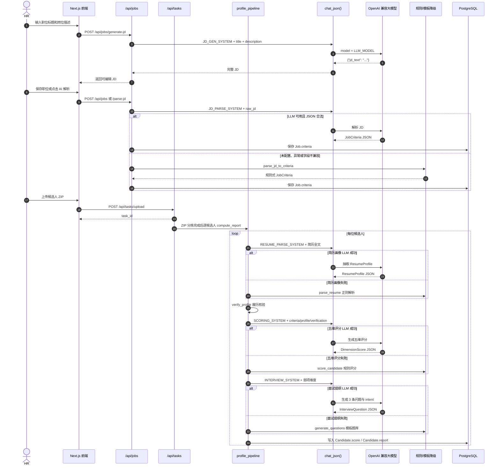
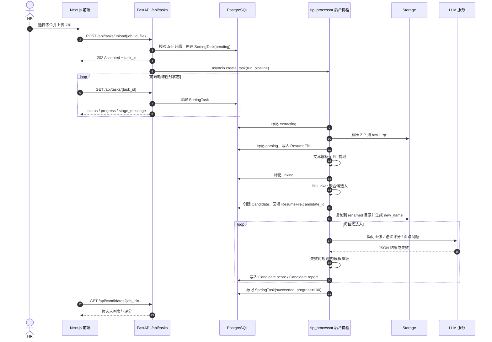
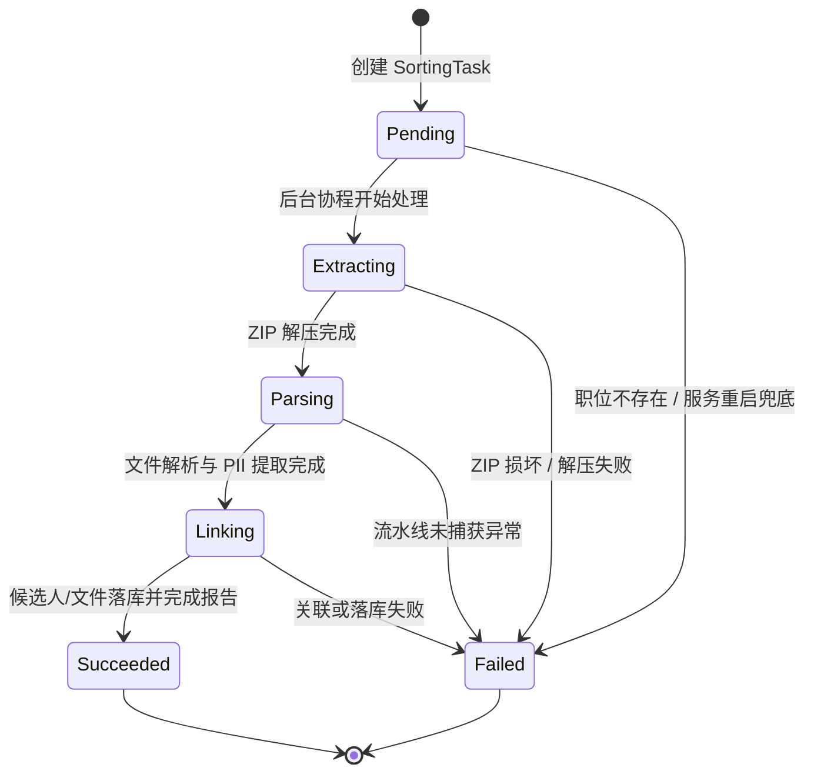
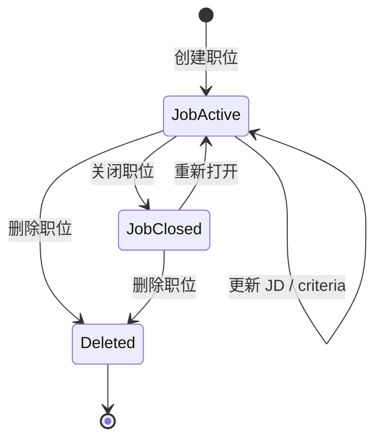
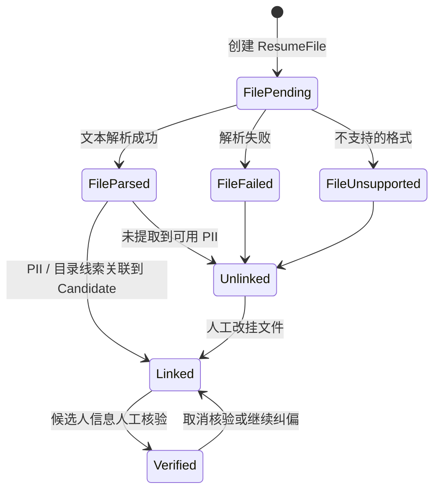

# 猎鹰 Falcon AI · 智能招聘管理系统

> HR 拖一个 ZIP，AI 还你一份可读的人才报告。

从「乱码压缩包」到「结构化人才报告」的一站式智能招聘流水线：自动解压 → PII 关联 → 物理重命名 → 简历画像 → 五维评分 → 面试提纲，全链路无感降级、零宕机风险。

---

## ✨ 核心能力

| 阶段 | AI 能力 | 触发点 | 降级策略 |
| :-: | :--- | :--- | :--- |
| 1 | **AI 写 JD** | 职位创建页「AI 帮我写 JD」 | 直接报错提示 |
| 2 | **JD → 结构化匹配基准** | 保存 JD / 点击「AI 解析」 | 正则关键词解析 |
| 3 | **简历文本 → 结构化画像** | ZIP 分拣后画像流水线 | 正则抽取 `parse_resume` |
| 4 | **五维语义评分** | 画像 + 基准生成候选人报告 | 规则式 `score_candidate` |
| 5 | **面试提纲（带考察意图）** | 报告生成后 | 模板题库 `generate_questions` |

> LLM 默认走火山方舟 Doubao 1.5 Pro（OpenAI 兼容协议），任何一环 LLM 不可达均自动降级。

---

## 🏗️ 仓库结构

```
falcon-recruit/
├── backend/                       # FastAPI + SQLModel + PyMuPDF
│   ├── app/                       # 业务代码（api/services/schemas/core）
│   ├── scripts/                   # smoke 脚本（smoke_jobs/smoke_scoring/smoke_phase5）
│   ├── Dockerfile                 # 多阶段 · python:3.12-slim
│   └── requirements.txt
├── frontend/                      # Next.js 14 + Tailwind + Shadcn UI
│   ├── src/                       # app router / components / lib
│   └── Dockerfile                 # 多阶段 · Next.js standalone
├── docs/                          # PRD / TDD / 用户操作手册
├── docker-compose.yml             # 基础设施：postgres + redis
├── docker-compose.prod.yml        # 生产 override：前后端容器
└── .env.example                   # 根变量模板
```

---

## 🧭 架构心智模型

本节用一组从宏观到微观、从静态到动态的 Mermaid 图串起系统：先看 C4 前三层，再看数据与大模型能力如何流动、关键业务如何交互、核心实体如何变迁。

### C4 第 1 层 · 系统上下文图



### C4 第 2 层 · 容器图



### C4 第 3 层 · 后端组件图



### 数据流图



### 大模型使用总览

系统没有把不同环节硬编码到不同模型，而是通过一个 OpenAI 兼容客户端统一调用：

| 配置 / 模型 | 来源 | 作用范围 | 说明 |
| :-- | :-- | :-- | :-- |
| `LLM_MODEL=doubao-1-5-pro-32k-250115` | `.env.example`、`docker-compose.prod.yml` | 生产默认大模型 | 默认走火山方舟 Doubao 1.5 Pro，使用 OpenAI 兼容 `/chat/completions` 协议 |
| `LLM_MODEL=gpt-4o` | `backend/app/core/config.py` 代码默认值 | 本地代码默认值 | 如果未通过环境变量覆盖但配置了 `OPENAI_API_KEY`，客户端会使用该模型名 |
| 任意 OpenAI 兼容模型 | `OPENAI_BASE_URL` + `OPENAI_API_KEY` + `LLM_MODEL` | 全部 LLM 能力点 | 可替换为 OpenAI、火山方舟或其他兼容厂商；接口统一由 `services.llm.client.chat_json()` 封装 |

| 业务节点 | 代码入口 | 大模型参与环节 | 输入 | 输出 | 降级策略 |
| :-- | :-- | :-- | :-- | :-- | :-- |
| AI 写 JD | `POST /api/jobs/generate-jd` → `generate_jd_async` | 根据职位名称和简述生成完整 JD 文本 | `title`、`description` | `jd_text` | 未配置或调用失败时返回 503，提示配置 LLM |
| JD 解析 | `POST /api/jobs/parse-jd`、创建职位 → `parse_jd_to_criteria_async` | 将自然语言 JD 解析为结构化匹配基准 | `raw_jd`、可选职位标题 | `JobCriteria`：学历、年限、技能、行业、薪资、地点 | 规则关键词解析 `parse_jd_to_criteria` |
| 简历画像 | ZIP 分拣后 / 报告刷新 → `parse_resume_async` | 将简历全文抽取为结构化候选人画像 | 简历文本、候选人姓名兜底值 | `ResumeProfile`：经历、教育、技能、期望、摘要 | 正则与分节解析 `parse_resume` |
| 五维评分 | `profile_pipeline.compute_report` → `score_candidate_async` | 基于岗位基准、画像、履历核验生成五维评分理由 | `JobCriteria`、`ResumeProfile`、`VerificationReport` | 五维 `DimensionScore`、总分、优势劣势 | 规则评分 `score_candidate` |
| 面试提纲 | `profile_pipeline.compute_report` → `generate_questions_async` | 根据低分维度和弱项生成 3 条问题与考察意图 | 弱项维度、弱项描述、职位标题 | `InterviewQuestion[]`，含 `intent` | 模板题库 `generate_questions` |

### 大模型能力流图



### 大模型调用时序图 · 从职位到候选人报告



### 关键业务节点时序图 · 上传 ZIP 到候选人报告



### 关键业务节点时序图 · 登录与受保护 API

```mermaid
sequenceDiagram
    autonumber
    actor User as 用户
    participant UI as Next.js 前端
    participant Auth as /api/auth
    participant Redis as Redis
    participant DB as PostgreSQL
    participant Biz as 业务 API

    User->>UI: 输入邮箱和密码
    UI->>Auth: POST /api/auth/login
    Auth->>DB: 查询用户并校验 bcrypt 密码
    Auth->>Redis: 写入 session:{session_id}，TTL 24h
    Auth-->>UI: Set-Cookie: session_id; HttpOnly; SameSite=Lax
    UI->>Biz: 请求 /api/jobs / /api/tasks / /api/candidates
    Biz->>Redis: 通过 Cookie session_id 读取 user_id
    Biz->>DB: 查询 User 并校验 is_active
    Biz->>DB: 按 owner_id 过滤业务数据
    Biz-->>UI: 返回当前用户可访问的数据
```

### 核心实体状态图







### 模块职责速览

| 层级 | 主要模块 | 职责 |
| :-- | :-- | :-- |
| Web UI | `frontend/src/app`、`frontend/src/components` | 登录注册、职位管理、ZIP 上传、分拣工作台、报告查看、导出入口 |
| 前端数据层 | `frontend/src/lib/api`、`frontend/src/lib/hooks`、`frontend/src/lib/store` | Axios API 封装、TanStack Query 数据获取、Zustand 认证态 |
| API 层 | `backend/app/api/endpoints` | HTTP 入参校验、鉴权依赖、限流、状态码与响应模型 |
| 核心能力层 | `backend/app/services` | JD 解析、ZIP 分拣、文件解析、PII 关联、候选人报告、导出 |
| 基础设施层 | `backend/app/core` | 配置、数据库会话、Redis Session、异常处理、日志、限流 |
| 数据层 | `backend/app/models` | `User`、`Job`、`SortingTask`、`Candidate`、`ResumeFile` 五类核心表 |

---

## 🚀 快速开始

> ⚡ **日常迭代只需记这一条命令**（本地 Windows → 远程服务器 `192.168.10.130:8080`）：
> ```powershell
> powershell -ExecutionPolicy Bypass -File scripts\deploy-to-server.ps1
> ```
> 详见下方 [模式 C · 一键远程部署](#模式-c--一键远程部署日常迭代推荐-)。

### 先决条件
- Docker Desktop ≥ 24
- Node.js ≥ 20 + npm（仅本地开发模式需要）
- Python ≥ 3.10（仅本地开发模式需要）

### 模式 A · 本地开发（仅容器化基础设施，推荐日常使用）

```bash
# 1) 克隆并配置
git clone git@github.com:pleasureswx123/falcon-recruit.git
cd falcon-recruit
cp .env.example .env
cp backend/.env.example backend/.env        # 填入 OPENAI_API_KEY 可选
cp frontend/.env.local.example frontend/.env.local

# 2) 起基础设施（Postgres + Redis）
docker compose up -d

# 3) 启动后端（另开一个终端）
cd backend
python -m venv .venv && .\.venv\Scripts\activate      # Windows
# source .venv/bin/activate                            # macOS / Linux
pip install -r requirements.txt
uvicorn main:app --reload --port 8000

# 4) 启动前端（再开一个终端）
cd frontend
npm install
npm run dev                # http://localhost:3000

Remove-Item -Recurse -Force .next
```

### 模式 B · 全栈容器化（服务器部署 / 演示）

```bash
cp .env.example .env                # 编辑密码、LLM key、API_BASE_URL
docker compose -f docker-compose.yml -f docker-compose.prod.yml up -d --build

# 查看服务状态
docker compose -f docker-compose.yml -f docker-compose.prod.yml ps
# 访问地址: http://<host>:80  (通过 Nginx 统一入口)
# 前端页面: http://<host>/
# 后端 API: http://<host>/api/
# API 文档: http://<host>/api/docs
```

**架构说明：**
- **Nginx** 作为反向代理，统一处理所有请求
- `/` → 前端 Next.js 应用
- `/api/` → 后端 FastAPI 服务
- 彻底解决跨域问题，前后端在同一域名下

**验证部署：**
```bash
# Linux/macOS
bash scripts/verify_nginx.sh

# Windows PowerShell
.\scripts\verify_nginx.ps1
```

---

### 模式 C · 一键远程部署（日常迭代推荐 ⭐）

> 适用场景：**本地 Windows 11 开发机 → 远程 Linux 服务器** `192.168.10.130:8080`
> 这是日常代码改完后**唯一需要记住的一条命令**，所有同步、构建、迁移、重启全自动完成。

#### Windows 11（PowerShell）—— 唯一入口

```powershell
powershell -ExecutionPolicy Bypass -File scripts\deploy-to-server.ps1
```

#### macOS / Linux 客户端（等价命令）

```bash
bash scripts/deploy-to-server.sh
```

#### 脚本自动完成的事

1. 检查本地工具（`ssh` / `scp` / `tar`）
2. 校验本地 `.env` 是否存在（不存在自动复制 `.env.example` 并退出提醒）
3. 打包源码（排除 `node_modules` / `.next` / `__pycache__` / `.env` / `.git` 等）
4. SCP 上传源码包 + 单独上传 `.env` 到 `/opt/falcon-recruit`
5. SSH 到服务器：停止旧容器（**保留 postgres-data / redis-data 数据卷**）、清理旧代码
6. 启动 `postgres` + `redis`，等待数据库就绪
7. 执行数据库迁移脚本（**幂等**，已存在的表会自动跳过）
8. `docker compose ... up -d --build` 构建并启动 `backend` / `frontend` / `nginx`
9. 健康检查 `http://192.168.10.130:8080/api/health`

#### 部署后访问入口

| 用途 | URL |
| :-- | :-- |
| 前端页面 | http://192.168.10.130:8080/ |
| 后端 API | http://192.168.10.130:8080/api/ |
| 健康检查 | http://192.168.10.130:8080/api/health |
| API 文档 | http://192.168.10.130:8080/api/docs |

#### 服务器侧常用运维命令

```bash
# 容器状态
ssh root@192.168.10.130 "docker ps --filter name=falcon"

# 实时日志
ssh root@192.168.10.130 "docker logs -f falcon-backend"
ssh root@192.168.10.130 "docker logs -f falcon-frontend"
ssh root@192.168.10.130 "docker logs -f falcon-nginx"

# 重启单个服务
ssh root@192.168.10.130 "cd /opt/falcon-recruit && docker compose -p falcon-recruit restart backend"

# 停止全部（保留数据卷）
ssh root@192.168.10.130 "cd /opt/falcon-recruit && docker compose -p falcon-recruit down"
```

#### 常见误报识别

- 终端里看到红色 `ssh.exe : Container falcon-xxx Running` / `NativeCommandError`：**不是真错误**，是 `docker compose` 把状态信息写到 stderr，PowerShell 显示成红色。脚本会继续执行。
- 若脚本卡在「检查并执行数据库迁移...」几分钟：正常，首次部署 backend 镜像在构建（pip install）。
- 若卡在「构建并启动所有服务...」5–10 分钟：正常，frontend 在跑 `next build`。

#### 修改默认目标服务器

脚本默认部署到 `root@192.168.10.130:/opt/falcon-recruit`，要换目标改参数即可：

```powershell
powershell -ExecutionPolicy Bypass -File scripts\deploy-to-server.ps1 `
    -ServerHost 10.0.0.50 -ServerUser deploy -RemoteDir /srv/falcon-recruit
```

---

## 🔑 环境变量速查

| 变量 | 用途 | 默认 |
| :-- | :-- | :-- |
| `POSTGRES_USER/PASSWORD/DB` | Postgres 账号 | falcon / falcon_dev_pw / falcon |
| `POSTGRES_PORT` / `REDIS_PORT` | 宿主机映射端口 | 5432 / 6379 |
| `DATABASE_URL` | 后端数据库（compose 内部自动注入） | `postgresql+asyncpg://…` |
| `REDIS_URL` | Redis 连接 | `redis://127.0.0.1:6379/0` |
| `OPENAI_API_KEY` | LLM Key（留空即降级） | — |
| `OPENAI_BASE_URL` | LLM endpoint | 火山方舟 `/api/v3` |
| `LLM_MODEL` | 模型名 | `doubao-1-5-pro-32k-250115` |
| `NGINX_PORT` | Nginx 对外端口 | 80 |
| `MAX_UPLOAD_MB` | ZIP 上传上限 | 200 |

---

## 🧪 冒烟测试

```bash
cd backend
.\.venv\Scripts\python.exe scripts\smoke_jobs.py        # 职位 CRUD + AI 解析 JD
.\.venv\Scripts\python.exe scripts\smoke_scoring.py     # 画像 → 评分 → 面试 → 简历 LLM
.\.venv\Scripts\python.exe scripts\smoke_phase5.py      # Dashboard + 导出
```

均打印 `ALL PASS ✓` 即全绿。

---

## 📚 文档

- [`docs/PRD.md`](docs/PRD.md) — 产品需求文档（含 AI 能力全景矩阵）
- [`docs/TDD.md`](docs/TDD.md) — 技术设计文档（含 AI 调用链路、部署与运维）
- [`docs/用户操作手册.md`](docs/用户操作手册.md) — HR 端使用指南

---

## 🛠️ 技术栈

**Backend** · FastAPI · SQLModel · asyncpg · PyMuPDF · python-docx · OpenAI SDK (兼容火山方舟) · Pydantic v2
**Frontend** · Next.js 14 (App Router) · TypeScript · Tailwind · Shadcn UI · TanStack Query · Zustand · React Hook Form + Zod
**Infra** · PostgreSQL 16 · Redis 7 · Docker Compose

---

## 📄 License

内部项目，未开源授权。
